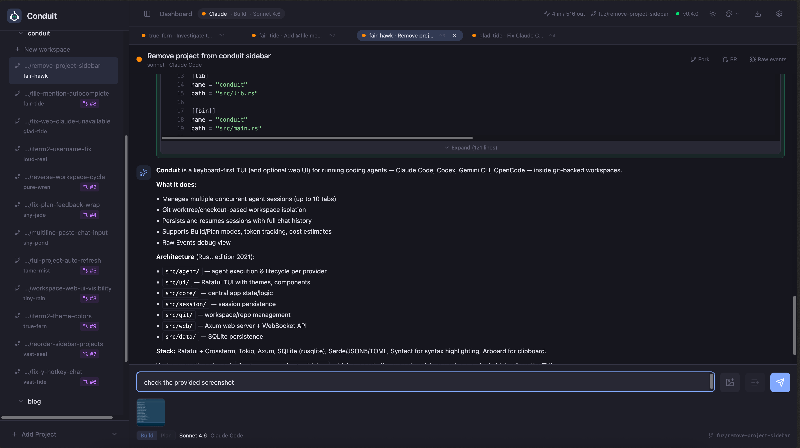
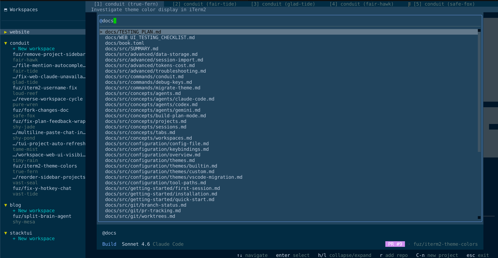
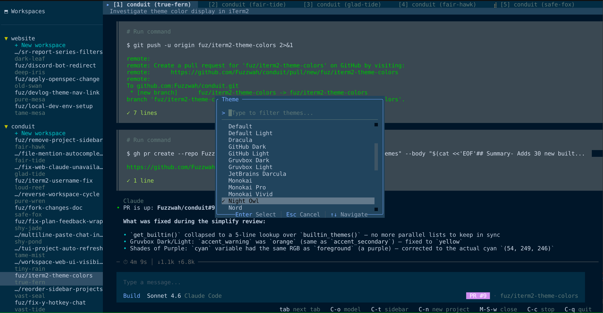

# Fork Changes

This documents the changes made in [Fuzzwah/conduit](https://github.com/Fuzzwah/conduit) relative to the upstream [conduit-cli/conduit](https://github.com/conduit-cli/conduit).

> **Screenshots:** Place image files in `docs/screenshots/` and they will render inline below.

---

## 1. Workspace Setup Script

After a workspace is created, Conduit now looks for a `workspace_setup.sh` script in the repository root and runs it automatically. This is useful for installing dependencies, setting up environment files, or running any other per-workspace initialisation steps without manual intervention.

This applies to workspaces created from both the TUI and the web UI.

---

## 2. Paste Images into Web UI Chat

The web UI chat input now supports pasting images directly from the clipboard (`Ctrl+V` / `Cmd+V`). Pasted images are embedded in the message and sent to the agent alongside the text prompt.

The TUI also received a companion fix: bracketed paste mode is now properly enabled, so multi-line text pasted into the input is handled correctly instead of being submitted prematurely.

---

## 3. Alt+Tab No Longer Cycles to the Sidebar

Previously, `Alt+Tab` / `Alt+Shift+Tab` would include the sidebar in the workspace cycle, which made keyboard navigation feel inconsistent. The sidebar is now excluded so the shortcut moves only between agent tabs.

---

## 4. Plan Mode Feedback Input Wraps Long Text

Long text typed into the plan mode feedback input now wraps within the input box rather than overflowing off-screen. This makes it easier to write detailed instructions before submitting.

---

## 5. TUI Project List Auto-Refreshes

When a new project is added via the web UI, the TUI sidebar project list now updates automatically without requiring a restart or manual refresh. The TUI polls for changes and merges them in the background.

---

## 6. Copy Code Blocks to Clipboard

Two shortcuts for copying code blocks from agent output:

- **`y`** — when in scroll mode (after pressing `PgUp` or similar), pressing `y` copies the nearest code block to the clipboard.
- **`Alt+y`** — a global hotkey that copies the nearest code block regardless of the current focus, so you do not need to enter scroll mode first.

---

## 7. Reorder Projects in the Sidebar

Projects in the sidebar can now be reordered via drag-and-drop in the web UI, or with dedicated move-up / move-down actions in the TUI. The order is persisted and reflected across both interfaces.

---

## 8. `@filename` Autocomplete in Chat Input

Typing `@` in the TUI chat input triggers an autocomplete menu that lists files in the current workspace. Selecting a file inserts its path as a mention, making it easy to reference specific files in prompts without typing paths by hand.

---

## 9. 30 Built-in Themes

The theme picker now ships with 30 built-in themes, including a full set of iTerm2-compatible colour palettes. Themes can be switched live from the command palette (`Ctrl+P` → `theme`) without restarting.

