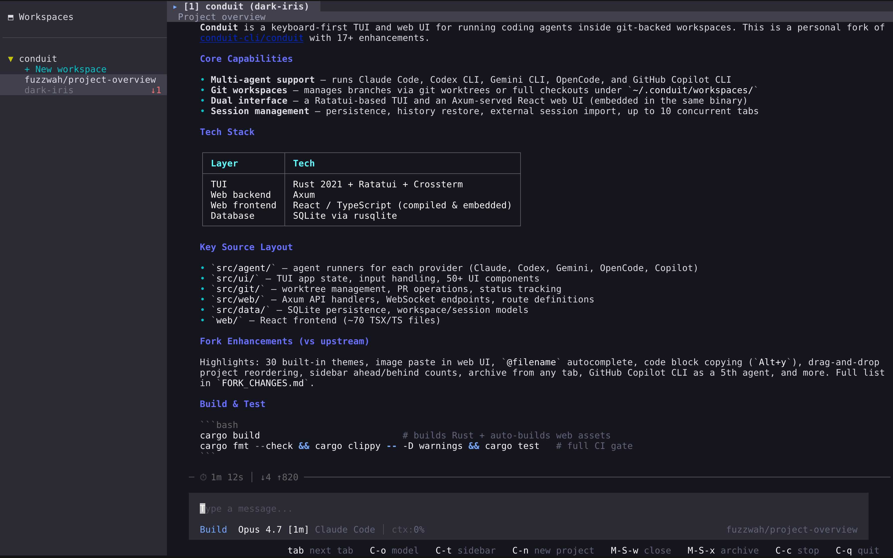
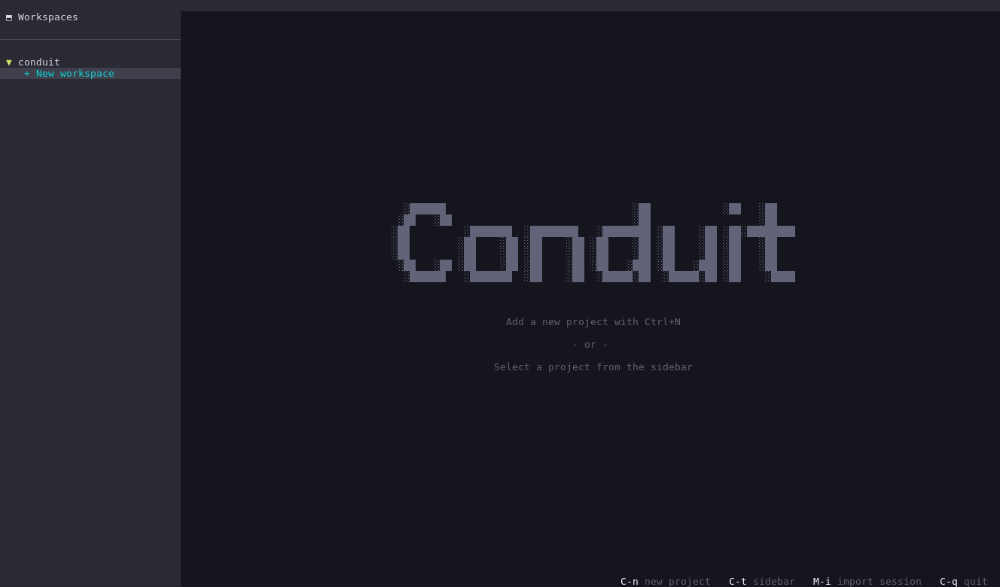
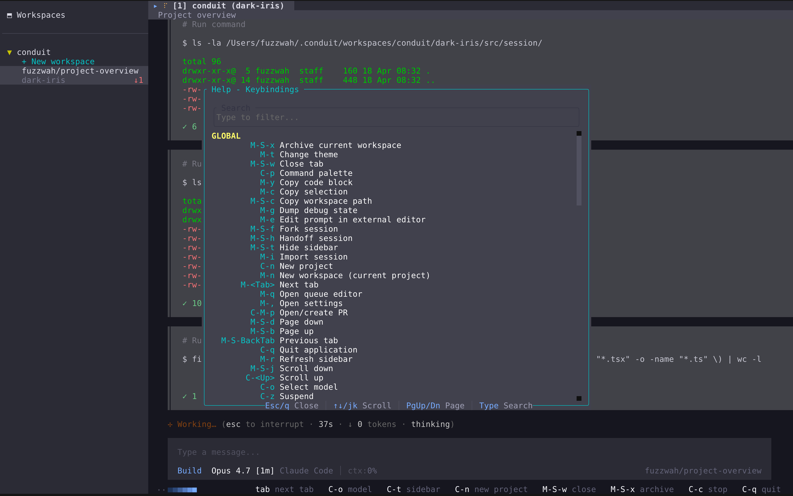
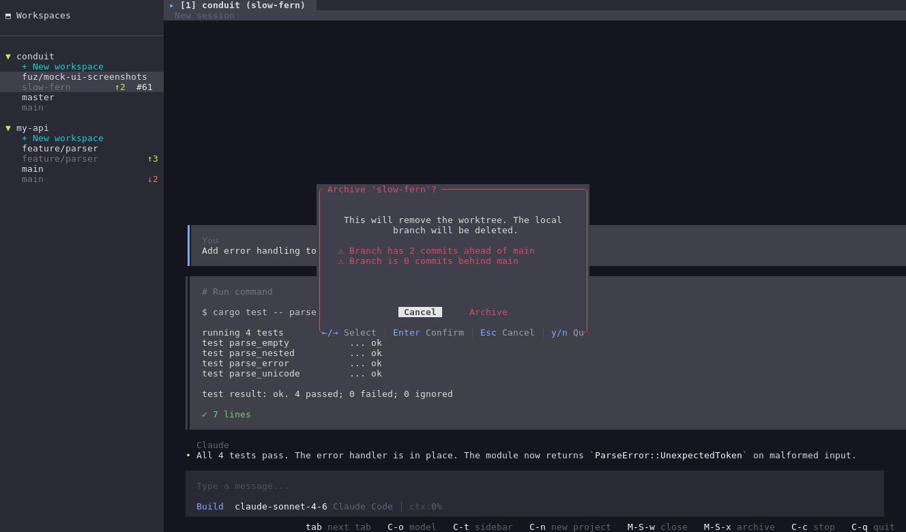
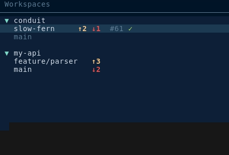
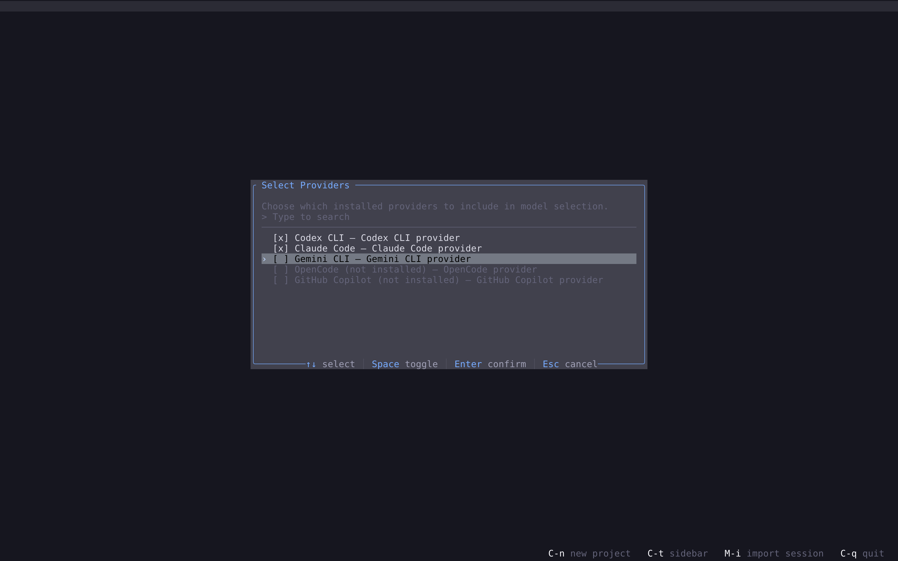
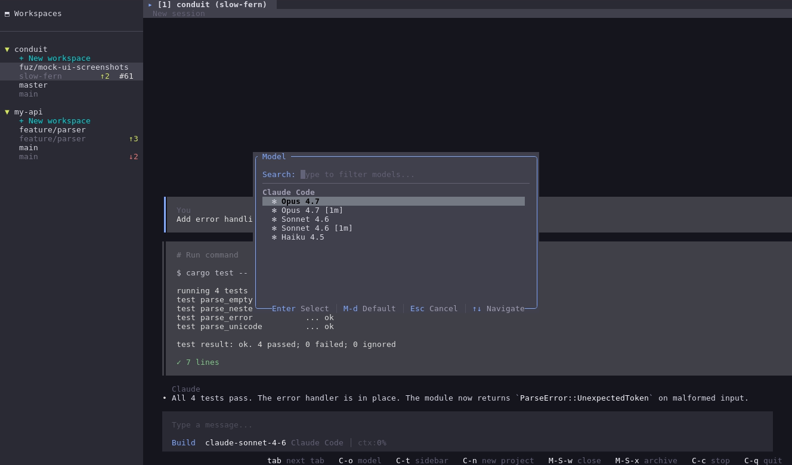

# Fork Changes

This documents the changes made in [Fuzzwah/conduit](https://github.com/Fuzzwah/conduit) relative to the upstream [conduit-cli/conduit](https://github.com/conduit-cli/conduit).

> **Screenshots:** Place image files in `docs/screenshots/` and they will render inline below.

## At A Glance







---

## 1. Workspace Setup Script

After a workspace is created, Conduit now looks for a `workspace_setup.sh` script in the repository root and runs it automatically. This is useful for installing dependencies, setting up environment files, or running any other per-workspace initialisation steps without manual intervention.

This applies to workspaces created from both the TUI and the web UI.

---

## 2. Paste Images into Web UI Chat

The web UI chat input now supports pasting images directly from the clipboard (`Ctrl+V` / `Cmd+V`). Pasted images are embedded in the message and sent to the agent alongside the text prompt.

The TUI also received a companion fix: bracketed paste mode is now properly enabled, so multi-line text pasted into the input is handled correctly instead of being submitted prematurely.


---

## 3. Alt+Tab No Longer Cycles to the Sidebar

Previously, `Alt+Tab` / `Alt+Shift+Tab` would include the sidebar in the workspace cycle, which made keyboard navigation feel inconsistent. The sidebar is now excluded so the shortcut moves only between agent tabs.

---

## 4. Plan Mode Feedback Input Wraps Long Text

Long text typed into the plan mode feedback input now wraps within the input box rather than overflowing off-screen. This makes it easier to write detailed instructions before submitting.

---

## 5. TUI Project List Auto-Refreshes

When a new project is added via the web UI, the TUI sidebar project list now updates automatically without requiring a restart or manual refresh. The TUI polls for changes and merges them in the background.

---

## 6. Copy Code Blocks to Clipboard

**`Alt+y`** copies the nearest visible code block to the clipboard regardless of current focus. Pressing `Alt+y` repeatedly cycles through all code blocks in the current output.

---

## 7. Reorder Projects in the Sidebar

Projects in the sidebar can now be reordered via drag-and-drop in the web UI, or with dedicated move-up / move-down actions in the TUI. The order is persisted and reflected across both interfaces.

---

## 8. `@filename` Autocomplete in Chat Input

Typing `@` in the TUI chat input triggers an autocomplete menu that lists files in the current workspace. Selecting a file inserts its path as a mention, making it easy to reference specific files in prompts without typing paths by hand.


---

## 9. 30 Built-in Themes

The theme picker now ships with 30 built-in themes, including a full set of iTerm2-compatible colour palettes. Themes can be switched live from the command palette (`Ctrl+P` → `theme`) without restarting.


---

## 10. Archive Workspace from Inside a Tab

**`Alt+Shift+X`** archives the current workspace from anywhere — both from within a workspace tab and from the sidebar. Previously archiving required navigating to the sidebar and pressing `x`; both contexts now use the same hotkey.

The archive hint appears in the chat footer, and the action is available in the command palette.



---

## 11. Sidebar Selection Tracks Active Tab When Hidden

When switching or closing tabs with the sidebar hidden, the sidebar selection now stays in sync with the active workspace. Previously, opening the sidebar after a tab change would still show the previously-selected workspace highlighted.

---

## 12. Squash-Merge Detection and GitHub PR Status in Archive Preflight

The archive preflight check now distinguishes between genuinely unmerged branches and branches that were squash-merged. When a branch has commits not in main's ancestry but the diff against main is empty, the dialog shows "Squash-merged (N commits ahead, diff already in main)" at informational severity rather than the alarming "Branch not merged" warning.

Optionally, the preflight can also query the GitHub CLI for the actual PR state. When `workspaces.use_gh_cli_merge_status = true` is set in the config, the archive dialog shows the live PR state: "PR merged (via GitHub)", "PR is open", "PR is a draft", or "PR closed without merging" (as a warning). The git-based detection remains active as a fallback when `gh` is unavailable or the PR is not found.

```toml
[workspaces]
use_gh_cli_merge_status = true
```

---

## 13. Always-Visible Sidebar Mode

A new `always_show_sidebar` config option keeps the sidebar permanently on screen:

```toml
[ui]
always_show_sidebar = true
```

When enabled, `Ctrl+T` toggles **focus** to the sidebar rather than hiding it, and opening or creating a workspace no longer closes it. Press `Escape` to return focus to the chat input while keeping the sidebar visible.

---

## 14. Ahead/Behind Counts in the Sidebar

Each workspace in the sidebar now shows `↑N` (yellow) and `↓N` (red) indicators when its branch has commits ahead of or behind `origin/main`. Both indicators are suppressed when zero, keeping the display clean. Counts are refreshed every 30 seconds without a network fetch.

```
  ▼ feature/my-branch
     my-workspace     +3 -1 ↑2 ↓1 #42 ✓
```



---

## 15. Full Plan Content in Chat

The plan review step no longer caps plan content at 15 lines. The full plan is now rendered inline as part of the scrollable chat history, so long plans can be read in their entirety by scrolling back.

---

## 16. GitHub Copilot CLI as a 5th Agent

The standalone `copilot` CLI is now supported as a 5th agent alongside Claude, Codex, Gemini, and OpenCode. This provides access to GitHub Copilot's model lineup — including the Codex models — for users with a GitHub Copilot subscription but no direct OpenAI API key.

**Invocation:** `copilot -p "PROMPT" -s --allow-all [--model=MODEL]` (single-shot programmatic mode)

**Available models:** `gpt-5.3-codex` (default), `gpt-5.3-codex-spark`, `gpt-5.4`, `gpt-5.4-mini`, `gpt-5.4-nano`, `gpt-5.2`, `gpt-5.2-codex`, `gpt-5-mini`, `gpt-4.1`, `gpt-4o`, `claude-haiku-4.5`, `claude-sonnet-4`, `claude-sonnet-4.5`, `claude-sonnet-4.6`, `gemini-2.5-pro`, `gemini-3-flash`, `gemini-3.1-pro`, `grok-code-fast-1`, `raptor-mini`, `goldeneye`

**Known limitation:** The `copilot` CLI has no session resumption flag, so each turn within a Conduit session starts a fresh process with no conversation history.

Copilot appears in the agent selector, model selector (`Ctrl+O`), provider selector, and session import picker. It must be enabled via the provider selector before it appears in the model list.





---

## 17. Companion tmux Configuration (`~/.tmux.conf`)

A tmux status bar tuned to complement Conduit's Night Owl colour scheme. Key settings:

```tmux
set -g set-clipboard on

# Match the Night Owl background
set -g status-style "bg=#011627,fg=#5f7e97"

# Align everything to the left
set -g status-justify left

# Left side: teal icon + bold current command name
set -g status-left "#[fg=#7fdbca]   #[fg=#d6deeb,bold]#{pane_current_command}  "
set -g status-left-length 50

# Hide the default window list (command name in status-left is sufficient)
setw -g window-status-current-format ""
setw -g window-status-format ""

# Right side: minimalist time with dim blue pill
set -g status-right "#[fg=#1d3b53]#[fg=#d6deeb,bg=#1d3b53] %H:%M #[fg=#1d3b53,bg=default]"

set -g status-left-style default
```

- Background `#011627` matches Night Owl's editor background.
- Left segment shows `#{pane_current_command}` (e.g. `conduit`) in off-white bold, prefixed by a teal icon.
- The window list is suppressed entirely — the active command name is context enough.
- Right segment shows `HH:MM` inside a dim blue `#1d3b53` pill with powerline-style end caps.
- `set-clipboard on` allows tmux to sync with the system clipboard, which pairs well with Conduit's `Alt+y` copy shortcut.

---

## 18. Quit Confirmation Dialog (`Ctrl+Q`)

Instead of requiring two rapid keypresses to quit, `Ctrl+Q` now opens a proper confirmation dialog with **Quit** and **Cancel** buttons. The **Quit** option is pre-selected, so pressing Enter immediately after `Ctrl+Q` quits without further navigation. `Esc` dismisses the dialog; pressing `Ctrl+Q` a second time while the dialog is open also confirms quit.

---

## 19. Copy Local File into Workspace (`M-a`)

**`Alt+a`** opens a two-step file browser for copying a local file into the current workspace repository:

1. **Step 1 — source:** Browse the local filesystem (starting from the home directory) to select a file.
2. **Step 2 — destination:** Browse the repository's directory tree; press `c` to confirm the copy destination.

The file is copied via `fs::copy`. A footer message confirms the destination on success; `Esc` cancels at any point.

---

## 20. Upload File to Workspace via SCP (`M-u`)

**`Alt+u`** opens a destination browser within the current workspace repository. After selecting a directory and pressing `c`, Conduit displays an SCP command with the absolute destination path — automatically copied to the clipboard via OSC 52 (works over SSH/tmux). Run the SCP command from your workstation, then press Enter inside Conduit to scan the destination for newly arrived (or updated) files and see their names reported in the dialog.

---

## 21. Alt+Shift+Tab Cycles to Previous Tab

**`Alt+Shift+Tab`** (`M-S-Tab`) now cycles backward through workspace tabs. The existing `Alt+Tab` forward cycle is unchanged. The footer hint has been updated to show both shortcuts: `M-tab/M-S-tab: next/prev tab`.

---

## 22. TUI Text Input Improvements

Several input-handling fixes land across the TUI:

- **Word navigation:** `Alt+b` / `Alt+f` move the cursor backward / forward by word in the plan-mode feedback input (mirrors Emacs-style navigation, handles terminals that send these sequences for `Option+Left/Right`).
- **AskUserQuestion text wrap:** Long answers in the "type something" input now wrap within the box rather than overflowing off-screen.
- **Continuation-row indent:** The wrapped text input applies a consistent wrap point across all rows, fixing a 2-character misalignment on continuation rows.

---

## 23. Scroll Position Preserved During Streaming

Scrolling up while the agent is generating output now keeps the viewport pinned to your scroll position. New content growing below no longer yanks the view down. Scrolling back to the bottom restores auto-follow behaviour automatically.

---

## 24. Context-Window Percentage (`ctx%`) Shows Current Usage

The `ctx%` counter now reflects the current context-window state based on per-call token usage from each assistant message (`input + cache_creation + cache_read`). Previously it accumulated cumulative totals from the final result event, causing readings above 100% (seen as high as 908%) during long sessions. After compaction, `ctx%` naturally drops to match the post-compaction assistant message.

---

## 25. Web Chat Auto-Follow in Collapsed Code Blocks

While an agent streams output inside a collapsed markdown code block, the web chat view now keeps the collapsed block pinned to the bottom of the viewport. Previously, output continued inside the block but the main view appeared to stall.

---

## 26. GitHub Issue Picker Integration Test

The GitHub issue picker is now verified end-to-end: selecting an issue when creating a workspace correctly links the workspace to that issue and displays the issue title in the workspace header.

---

## 27. Pi Coding Agent as a 6th Agent

Conduit now supports **Pi** as an additional agent alongside Claude, Codex, Gemini, OpenCode, and Copilot.

- **Invocation:** `pi --mode rpc`
- **Sessions:** Pi sessions can be resumed, and Conduit preserves the live Pi process across turns so follow-up prompts stay in the same session.
- **History import:** Conduit can discover Pi sessions from `~/.pi/agent/sessions/` and import their visible chat history from Pi's JSONL session files.
- **Events/tools:** Pi's structured RPC event stream is mapped into Conduit's chat/debug views, including assistant text, reasoning, and tool execution events.

Pi appears in the agent selector, provider selector, and model selector. Common Pi model presets are included, with `claude-sonnet-4.6` as the default.

---

## 28. `/btw` Command — Queue a Note Without Interrupting

The `/btw` command, available natively in the Claude Code CLI, is now supported in the Conduit TUI.

- **`/btw <note>`** — immediately queues the note as a follow-up message without interrupting the agent. Works whether the agent is idle or actively running.
- **`/btw`** (no args) — opens the queue editor.
- The command appears in the `/` autocomplete menu with description "Queue a note without interrupting".

### Claude Code command tracking

Claude Code's built-in slash commands are compiled into the CLI binary and not discoverable programmatically. The table below tracks which commands conduit implements and how they map:

Verified against Claude Code v2.1.119 (`strings` on the binary).

| Claude Code command | Conduit equivalent | Status |
|---|---|---|
| `/btw <note>` | `/btw` → queues as `FollowUp` message | ✅ Implemented (this change) |
| `/clear` | `/new` → starts a new session | ✅ Equivalent |
| `/config` | `Ctrl+P` → Settings | ✅ Partial equivalent |
| `/effort <level>` | `/reasoning` | ✅ Equivalent |
| `/fast` | — | ❌ Not implemented |
| `/feedback` | — | ❌ Not implemented |
| `/help` | `?` on empty input | ✅ Equivalent |
| `/hooks` | — | ❌ Not implemented |
| `/init` | — | ❌ Not implemented |
| `/login` / `/logout` | — | ❌ Not implemented |
| `/mcp` | — | ❌ Not implemented |
| `/memory` | — | ❌ Not implemented |
| `/model` | `/model` | ✅ Implemented |
| `/quit` | `Ctrl+Q` | ✅ Equivalent |
| `/resume` | session import picker | ✅ Partial equivalent |
| `/rewind` | `/rewind` → removes last turn from display + truncates Claude session file | ✅ Implemented (Claude only) |
| `/status` | `/status` → shows agent/model/session/ctx%/turns/dir as a chat message | ✅ Implemented (all agents) |

To add a new command: add a variant to `ConduitCommand` in `src/command_resolver.rs`, handle it in `handle_submit_action` in `src/ui/app.rs`, update `slash_command_action` and `execute_resolved_conduit_command`, and add a row to this table.

---

## 29. Dirac CLI as a 7th Agent

Conduit now supports **Dirac** as an additional agent alongside Claude, Codex, Gemini, OpenCode, Copilot, and Pi.

- **Invocation:** `dirac --json --yolo --cwd /repo --model <model>`
- **Sessions:** Dirac sessions are resumable. Conduit captures the `task_started.taskId` from the first turn and passes `--taskId` on subsequent turns.
- **Events/tools:** Dirac's structured JSON output is mapped into Conduit's event model: assistant text, reasoning, command output, tool lifecycle, token usage, and failures.
- **History import:** Not yet supported (intentionally deferred).

Dirac appears in the agent selector, provider selector, and model selector. It must be enabled via the provider selector before it appears in the model list.

---

## 30. Provider/Agent Selectors Re-detect Installed Tools on Open

Opening the provider selector (Settings → providers) or agent selector (+ new tab) now re-runs tool detection. Agents installed after Conduit started (e.g. Dirac, Pi) become available without restarting.

---

## 31. OpenCode Tool Display Improvements

- The tool command display for OpenCode now tries `filePath`, `path`, and `file` as fallbacks when `file_path` is absent, and `cmd` as a fallback for `command`. This makes Read/Write/Edit/Bash tool headers render correctly in OpenCode sessions.
- Fallback display suppresses empty-looking JSON (`{}`, `null`) rather than showing `$ {}`.

---

## 32. Tab Characters Expanded in Tool Output

Tab characters in tool output were stripped by a control-character guard, causing line numbers from Claude Code's Read tool (`number + TAB + line`) to run directly into code. Tabs are now expanded to 8-column tab stops before rendering, matching standard terminal behaviour.

---

## 33. Pinned Agent Status Message

The latest assistant status message is now pinned to the top of the chat viewport once it is pushed there by accumulating tool output. A `─` separator marks the boundary between the pinned message and the scrollable content below. The pin deactivates automatically when the message is still within the normal scroll view.

---

## 34. Refreshed GitHub Copilot Model IDs

The hardcoded Copilot model list has been updated to match current GitHub Copilot naming. The full model set is:

`gpt-5.3-codex` (default), `gpt-5.3-codex-spark`, `gpt-5.4`, `gpt-5.4-mini`, `gpt-5.4-nano`, `gpt-5.2`, `gpt-5.2-codex`, `gpt-5-mini`, `gpt-4.1`, `gpt-4o`, `claude-haiku-4.5`, `claude-sonnet-4`, `claude-sonnet-4.5`, `claude-sonnet-4.6`, `gemini-2.5-pro`, `gemini-3-flash`, `gemini-3.1-pro`, `grok-code-fast-1`, `raptor-mini`, `goldeneye`

---

## 35. Error Dialog When Git URL Matches Existing Directory

When adding a project via git URL, if the derived target directory already exists in the projects base directory, the add-repo dialog now shows an inline error (`Directory '<name>' already exists`) instead of silently failing.

---

## 36. OpenSpec Development Workflow

Conduit now supports a full spec-driven development workflow using OpenSpec and Specify (spec-kit) specs.

- **OpenSpec change picker on workspace creation (#135):** When creating a new workspace, Conduit scans `openspec/changes/*/tasks.md` for incomplete (`- [ ]`) tasks and presents a picker. Selecting a change names the workspace after the `change_id`.
- **Conditional display with remote sync (#142):** The picker only appears when incomplete specs exist. The flow now syncs from remote (`git fetch origin`) first, then fetches GitHub issues and scans specs in parallel — skipping both pickers when nothing is relevant.
- **Spec-kit (specify) picker support (#145):** Conduit also detects `.specify/specs/*/tasks.md` files. When both OpenSpec and Specify specs are present, specify takes priority.
- **Auto-send context-load message (#153):** When a workspace is first opened after being created from a spec, Conduit automatically sends a prompt asking the agent to read the spec files and summarise remaining work.

---

## 37. Syntax Highlighting in Read Tool Output

File content displayed in Read tool output blocks is now syntax-highlighted using the same syntect pipeline used by the file viewer and markdown code blocks (#132). The language is detected from the file extension. The `cat -n` line-number prefixes are stripped before highlighting so syntect sees clean source code. Unknown extensions fall back to plain text.

A companion fix (#133) lowered the contrast threshold for `tool_block_bg` on dark themes, producing a noticeably darker and less distracting background for tool output blocks.

---

## 38. Default Theme: Night Owl on Fresh Install

Fresh installs with no theme configured now default to Night Owl instead of "Default Dark" (#140).

---

## 39. Pi Agent Stability Fixes

Two fixes land for the Pi agent integration:

- **Static allowlisted models (#134):** Pi model registration switched to a static allowlist matching the OpenRouter model set, with a guard test to prevent drift.
- **Extension model resolution (#144):** Pi model IDs are now stored as `provider/model_id` (e.g. `openrouter/deepseek/deepseek-v4-flash`) so Pi routes extension models correctly instead of trying to use the built-in provider. Pi's table output is correctly parsed to combine provider and model columns. The `set_pi_models` function, which was silently discarding discovered entries, was also fixed.

---

## 40. Stable Releases and Verified Install Pipeline (v0.5.0)

The fork now has a proper release pipeline and install flow (#146):

- Version bumped to `0.5.0` with `rust-toolchain.toml` pinning the stable channel.
- `scripts/preflight.sh` checks all build dependencies with OS-aware install hints.
- `release.yml` redesigned as a 5-stage gate: **verify** (full CI) → **build** (4 targets: x86\_64 + aarch64 Linux musl, aarch64 + x86\_64 macOS) → **smoke-test** (containers + QEMU + install.sh) → **release** (8 assets with sha256 sidecars) → **announce** (Discord).
- `website/public/install.sh` rewritten with correct repo URL, all 4 targets, sha256 verification, and `CONDUIT_INSTALL_FILE` local-file mode for CI smoke testing.
- `README.md` and `FORK_INSTALL.md` updated with the curl one-liner as the primary install method.

---

## 41. In-TUI Keybindings Editor

Keybindings can now be edited live from the TUI without editing `config.toml` by hand (#151):

- Accessible via Settings (`Alt+,`) → Keybindings.
- All bindings shown grouped by context (Global, Chat, Sidebar, etc.) with a live filter input.
- **Enter** on a binding enters capture mode — the next keypress is saved to `config.toml` via `toml_edit`.
- **Del** on an overridden binding resets it to default and removes the override from config.
- Overridden bindings are marked with `*` and accent colour.
- Conflict detection prevents binding a key already in use.
- In-memory config is reloaded after each save/reset, so changes take effect immediately.

Additional keybinding improvements:

- **Super/Cmd modifier support (#152):** `D-` prefix added for the macOS Command / Windows key. `Cmd` and `Super` are accepted as aliases in config.toml.
- **Show current key (#154):** The editor now shows the currently-configured key (not just the default) when a binding has been overridden, with the original shown dimmed in parentheses.
- **Live footer hints (#155):** Footer key hints now reflect user-remapped keybindings instead of hardcoded defaults. All four render call sites look up the live `KeybindingConfig`.
- **Remap replaces default (#160):** Remapping an action now replaces the default binding instead of adding alongside it. Previously remapping `C-t → C-s` would leave `C-t` still active.
- **BackTab notation fix (#175):** BackTab is now normalised to `S-<Tab>` with proper round-trip parsing. Legacy `<BackTab>` notation is still accepted for backward compatibility.
- **Hotkey remove fix (#176):** Correctly handles removing a keybinding that was previously added alongside a default, ensuring the removal actually takes effect.

---

## 42. Per-Repository TUI Theme Configuration

The theme picker now supports per-repository theme overrides (#156/#159):

- **`theme_name` column** added to the `repositories` SQLite table (migration 16).
- Theme picker gets a **`Tab` key scope toggle** (`Global` ↔ `Project`). Project scope is disabled when the active tab has no repository context.
- **`Ctrl+D`** clears a project theme override.
- **`[Global]` / `[Project]`** badge shown in the picker search bar.
- Themes are applied automatically on tab switch via `sync_theme_to_active_tab()`, called on every navigation path (sidebar click, mouse tab click, slash-command switch, new workspace tab, sidebar cursor move) (#164).
- A global theme change never visually overrides a project-specific override — the project theme is re-applied immediately after the global confirm.

### Night Fox Theme (#163)

A new built-in theme is shipped alongside the 30 existing ones: **Night Fox** — a dark red/orange variant of Night Owl. Burgundy-tinged dark backgrounds (`#1c0a0a` base) instead of deep navy, with orange primary accent, coral secondary, and amber/crimson for success/error states.

### Centered Session Title (#166)

The workspace header's session title is now horizontally centered and uses the theme's brightest colour (`text_bright`) instead of the muted secondary colour. Placeholder "New session" text retains muted styling.

### Removed Animated Footer Progress Bar (#156)

The Knight Rider animated spinner in the global footer was redundant alongside the "Working" indicator in the session area — it has been removed, giving key hints the full footer width.

---

## 43. Tab Reordering

Workspace tabs can now be reordered with **`Alt+Shift+,`** (move left) and **`Alt+Shift+.`** (move right) (#169). Tab position is persisted across sessions via `SaveSessionState`. The default keybindings were changed from `Alt+Shift+Left/Right` to `Alt+Shift+,/.` for iTerm2 compatibility (#171/#173). The reorder actions are registered as user-remappable in `settings.rs`.

---

## 44. Compact Tab Titles

Tab titles are now compact: a 10-character truncated project name (with `…` if longer) followed by the trailing segment of the git branch name in square brackets. Format: `conduit [old-rose]` instead of `conduit (old-rose)` (#170). The `branch_name` field is populated on `AgentSession` from `workspace.branch` at all session creation points and preserved through agent handoffs.

---

## 45. Dialogs Centered on Main Pane

All dialogs now centre within the main pane when the sidebar is visible, rather than across the full terminal width (#172). This affects `DialogFrame::render()` and all 10 dialog components (help, model selector, settings, keybindings editor, workspace defaults, rename project, file picker, multi-select, session import, project picker). When no sidebar is visible, behaviour is unchanged.

---

## 46. Kill Full Agent Process Trees on Archive

Archiving or removing a workspace now terminates the entire agent process tree instead of only the top-level PID (#174):

- Agent runners spawn into isolated process groups, so shutdown signals reach the full descendant tree (Claude child processes, Playwright MCP descendants, etc.).
- A shared `util::process` module provides Unix process-group setup and teardown with SIGTERM/SIGKILL escalation and PID start-time safety checks.
- `SessionManager` tracks PID start time for active web sessions.
- TUI and web session shutdown use the same shared process-tree cleanup, keeping archive/close behaviour consistent across both surfaces.

---

## 47. Code Block Copy Improvements

Several enhancements to the `Alt+y` code block copy feature (improving on entry #6 above):

- **Backward cycling (`Alt+Shift+y`)** (#130): cycles code blocks in reverse (toward newer blocks), complementing the existing forward cycle.
- **Auto-scroll to block** (#130): both forward and backward copy now auto-scroll the viewport to bring the copied block into view.
- **First press always moves** (#131): the first press of `Alt+y` or `Alt+Shift+y` always moves to the next/prev block, even if the current scroll position is ambiguous.
- **Green bar indicator** (#129): copied blocks are now indicated by a subtle green-background space on the left edge instead of a full background highlight, keeping code text fully readable.

---

## 48. Pinned Message Refinements

The pinned agent status message feature (entry #33 above) received a refinement:

- The pin now only activates when there is scrollable content below the pinned message (more cache, streaming output, extra lines) (#128/#124). When the agent's final response is the last item, normal scroll layout is restored, preventing the pinned message from obscuring earlier content.

---

## 49. File Viewer UX Improvements

The file viewer (opened via clickable file paths in chat or the `:open` command) received several UX improvements (#162):

- **Left margin:** 2-column left margin added to file content in both raw and rendered modes.
- **Line numbers:** Line numbers are shown by default in raw mode (existing behaviour, unchanged).
- **Restore origin tab:** Closing a file viewer tab now restores the exact tab that was active when the file was opened (`origin_tab_index`), instead of landing on whatever index happens to be last.

---

## 50. Help Dialog from Splash Screen and Sidebar

Pressing `?` now opens the help dialog from both the splash screen and the sidebar (previously only worked from the chat input). E2E tests have been updated to cover both entry points.

---

## 51. Tab/BackTab Pass-Through in Inline Prompts

Tab and BackTab are no longer silently consumed by inline prompt widgets (e.g. plan-mode feedback, single-question `AskUserQuestion`) when there are no question tabs to navigate (#158). Global hotkeys like tab switching and sidebar focus now work while an inline prompt is displayed. Multi-question navigation behaviour is unchanged.

---

## 52. Workspace Creation Sync, Issue/Spec Pickers, and Filtering

The new-workspace flow (Alt+N) now runs as an explicit three-phase prelude: sync with the remote, then offer an issue picker (when issues exist), then offer a spec picker (when incomplete openspec/spec-kit specs exist). Specs are read from the `origin/<default>` ref via `git ls-tree` + `git show`, so changes that have already been merged and archived on the remote no longer appear in the picker — even when the local working tree still contains the stale directories.

The issue source is now pluggable. GitHub continues to use the `gh` CLI; in addition, conduit can fetch issues from Gitea and Forgejo over their REST APIs when the host is listed in config:

```toml
[issues]
gitea_hosts = ["gitea.example.com"]
forgejo_hosts = ["codeberg.org"]
```

Authentication uses the `GITEA_TOKEN` and `FORGEJO_TOKEN` environment variables. Without a token, the provider returns no issues and the picker is silently skipped.

Both pickers also gained filtering: type to substring-filter the list, `Tab` to toggle a label filter (issue picker), `m` to restrict to your own assigned issues, and `s` to cycle the spec sort order.
